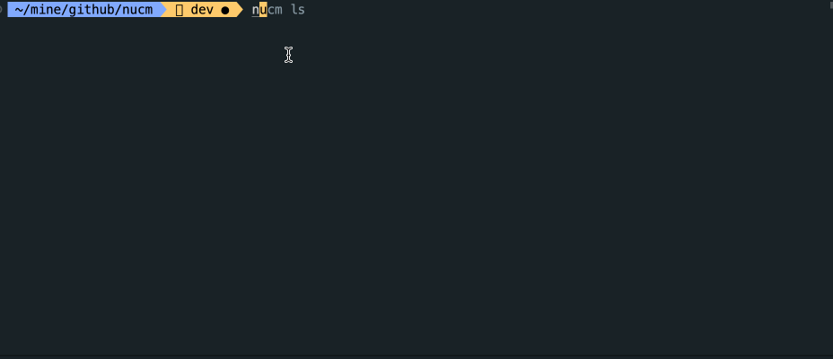

# 介绍

NUCM 的全称为 NPM User Change Manager，是一款高效而直观的 NPM 账号切换管理工具，为开发者提供了简便的方法来轻松切换和管理不同的 NPM 用户账号。无论是在开发多个项目，协作开发，还是在不同的工作环境中切换，该工具都能帮助用户保持无缝的 NPM 包管理体验。



## **主要特性包括：**

1. **快速账号切换**： 使用"NPM User Change Manager"，用户可以通过简单的命令或图形界面迅速切换到他们的不同 NPM 账号，无需反复输入认证信息。

2. **账号配置管理**： 支持灵活的账号配置，用户可以保存和管理多个 NPM 账号的配置信息，以便在需要时方便地切换。

3. **命令行和图形用户界面**： 提供命令行工具图形用户界面，满足不同用户的使用偏好，使切换账号变得轻松而灵活。

4. **安全性和隐私**："NPM User Change Manager"采用安全的认证方式，并确保用户的敏感信息得到妥善保护，提供了安全可靠的账号管理环境。

## **NUCM 工具的主要用户群体包括：**

- 经常遗忘 NPM 账号和密码的开发者
- 需要频繁切换多个 NPM 账号的开发者

## **简易操作指南**

NUCM 是一个基于 NPM [Access Tokens](more.html#获取-access-token-账号) 机制实现的账号切换管理工具，它的使用步骤简单易懂：

1、添加账号

```bash
$ nucm add test1 abcdefghijkl111 # 添加 test1 账号

$ nucm add test2 abcdefghijkl222 # 添加 test2 账号
```

2、切换账号

```bash
$ nucm use test2  # 切换 test2 账号
```

现在，您可以使用 test2 账号轻松发布您的 NPM 包。[立即开始](/start.html)
