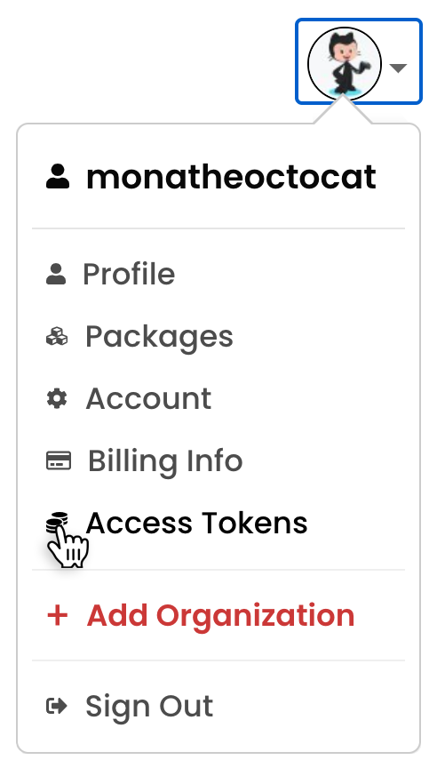

# 了解更多

如果你恰好看到了这篇文章，你一定是希望对这个项目贡献自己的一份力量。

欢迎任何形式的贡献，不管是一个错别字的修改，还是一次友好的建议，不管是通过提交 [Issue](https://github.com/beezen/nucm/issues), 还是一个帅气 [pull request](https://github.com/beezen/nucm/pulls)。

## NPM 账号关联配置

The settings `_auth`, `_authToken`, `username` and `_password` must all be scoped to a specific registry. This ensures that `npm` will never send credentials to the wrong host.

The full list is:

- `_auth` (base64 authentication string)
- `_authToken` (authentication token)
- `username`
- `_password`
- `email`
- `certfile` (path to certificate file)
- `keyfile` (path to key file)

## 获取 Access Token 账号

1、[NPM 官网](https://www.npmjs.com/)登录个人账号，在页面的右上角，单击“配置文件”图片，然后单击“访问令牌”

2、单击生成新的标记。

3、命名您的令牌。

4、选择访问令牌的类型（一般选 Publish,具体查看文档说明）

5、点击生成令牌。

6、从页面顶部复制令牌（access-tokens）。

> Access Tokens:
> An access token is an alternative to using your username and password for authenticating to npm when using the API or the npm command-line interface (CLI). An access token is a hexadecimal string that you can use to authenticate, and which gives you the right to install and/or publish your modules.

> 中文翻译：
> 访问令牌是使用 API 或 NPM 命令行界面（CLI）时使用您的用户名和密码进行身份验证到 NPM 的替代方案。访问令牌是您可以用于身份验证的十六进制字符串，并为您提供安装和/或发布模块的权利。

## 参考链接

- [npmrc](https://docs.npmjs.com/cli/v9/configuring-npm/npmrc)
- [about-access-tokens](https://docs.npmjs.com/about-access-tokens)
- [nrm](https://www.npmjs.com/package/nrm)
