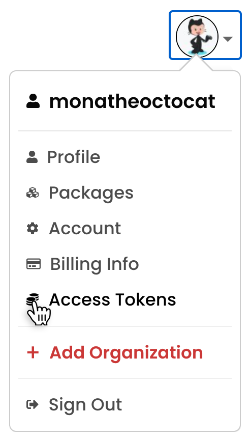
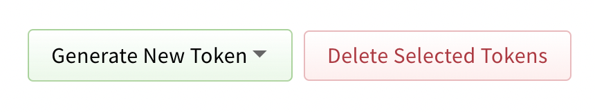
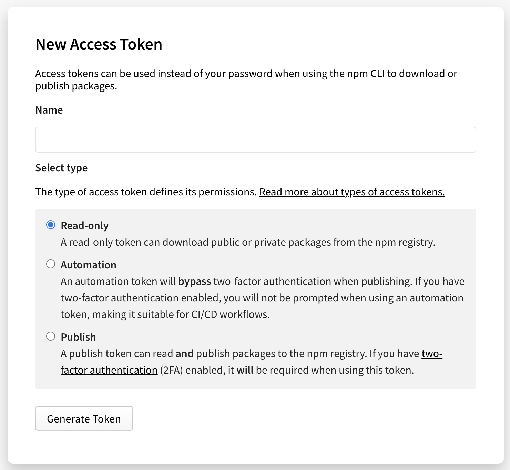

# 快速开始

## 安装

用你喜欢的包管理器安装 `nucm`：

```bash
$ npm install -g nucm

# 或使用 yarn
$ yarn global add nucm
```

## 操作步骤

### 1、添加账号

执行 `nucm add <name> <access-tokens>` 添加账号, `name` 为自定义的账号别名，`access-tokens` 为 NPM 账号令牌，例如：

```bash
$ nucm add beezen xxxxxxxxxxxxxxxx

添加账号成功
```

[点击查看 access-tokens 获取方式](#获取-access-token-账号)

### 2、查看账号列表

执行 `nucm ls` 可查看刚添加的账号是否出现在账号列表中，例如：

```bash
# 默认显示脱敏的
$ nucm ls

  beezend -- xxxxxx......xxxx
  beezen --- xxxxxx......xxxx
* beeze ---- xxxxxx......xxxx

# 显示详细列表
$ nucm ls -l # 或 nucm ls --list

  beezend -- xxxxxxxxxxxxxxxxxxxxxxx
  beezen --- xxxxxxxxxxxxxxxxxxxxxxx
* beeze ---- xxxxxxxxxxxxxxxxxxxxxxx
```

### 3、切换账号

执行 `nucm use <name>` 命令切换当前使用账号，例如：

```bash
$ nucm use beezen

已切换到账号 beezen
```

### 4、发布 NPM 包

到对应的 NPM 包根目录下执行 `npm publish`，则会使用第 3 步中账号的 Access Tokens 进行 NPM 包发布。

```bash
$ npm publish # 用切换的当前账号进行发布
```

## 常用命令

```bash
Usage: nucm [options] [command]

Options:
  -v,--version                查看版本
  -h, --help                  显示命令帮助

Commands:
  ls [options]                查看账号列表
  use <name>                  切换账号
  add <name> <access-tokens>  添加账号
  del <name>                  移除账号
  localize <lang>             使用本地化语言
  update [options]            更新版本
  save                        保存当前账号
  help [command]              display help for command
```

## 获取 Access Token 账号

1、[NPM 官网](https://www.npmjs.com/)登录个人账号，在页面的右上角，单击“配置文件”图片，然后单击“访问令牌”



2、单击生成新的标记。


3、命名您的令牌。

4、选择访问令牌的类型（一般选 Publish,具体查看文档说明）



5、点击生成令牌。

6、从页面顶部复制令牌（access-tokens）。

> Access Tokens:
> An access token is an alternative to using your username and password for authenticating to npm when using the API or the npm command-line interface (CLI). An access token is a hexadecimal string that you can use to authenticate, and which gives you the right to install and/or publish your modules.

> 中文翻译：
> 访问令牌是使用 API 或 NPM 命令行界面（CLI）时使用您的用户名和密码进行身份验证到 NPM 的替代方案。访问令牌是您可以用于身份验证的十六进制字符串，并为您提供安装和/或发布模块的权利。
